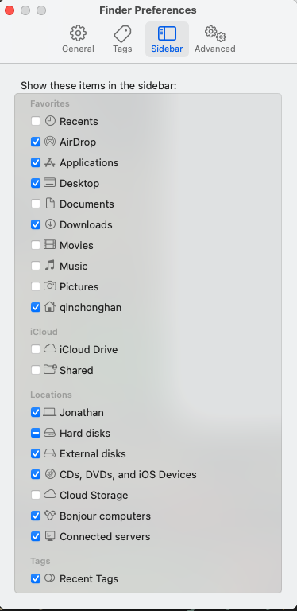
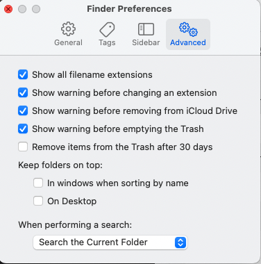

# betterMacos
There will be mainly three sections, as shown below, to help you better utilize your Mac.

- User Preferences (settings)
- Applications
- Tips

### 1. User Preferences

This section will share some of the settings of the macOS default applications. 

#### 1.1 Finder

macOS Finder is the default file management application for Apple's macOS operating system. It serves as the graphical user interface (GUI) for navigating and organizing files, folders, and drives on a Mac computer. For users that recently switch from Windows, it is the alternative of **File Explorer**. 

Press ``Command + ,`` to open the preferences of Finder. Here is my configuration for your reference. 

|  |  |  |
| ---------------------------------------------- | ---------------------------------------------- | ------------------------------------------------ |

I have mainly changed the **new Finder windows show:**, **items in the Sidebar**, **show filename extensions**. 

#### 1.2 System Preferences. 

#### ... still updating
